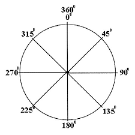
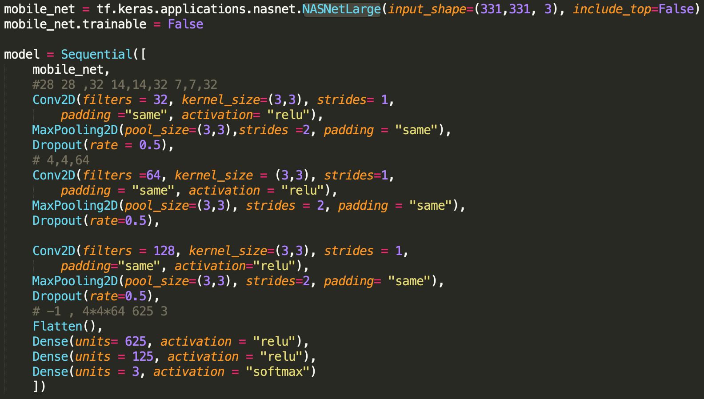
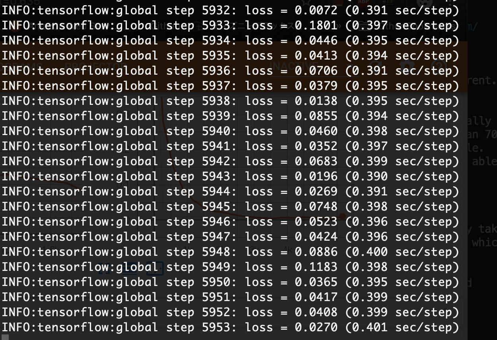
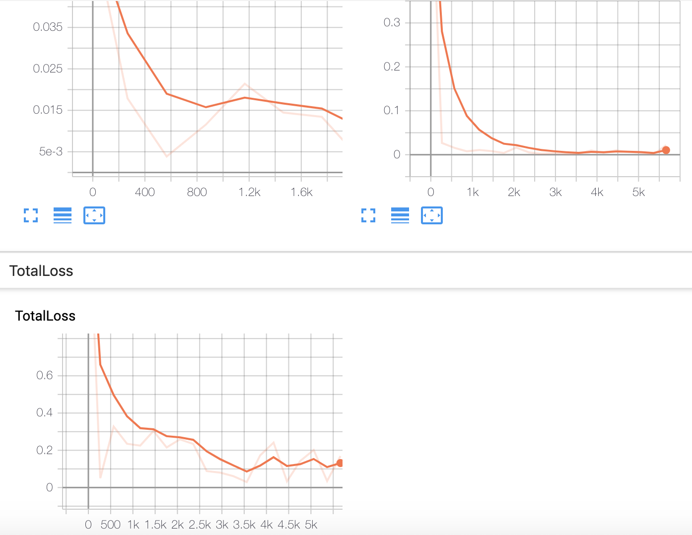

# Location -> Opponent's Behavior -> Automation

# Shooting Mode
- Shoot "Auto Q skills" on the enemy on Image Recognition

Based on the image recognition, the model that I create with 1,500 pictures is able to detect the enemy on League of Legends and makes ezreal shot "Q" to the enemy on the coordinate of x and y axis. 

# Explaination (Classification and Object Detection)

# 1. Images

I respectively save 2,500 images of Tower, Minion, and Ezreal on League of Legends (Total 3 classes)
- Used parser or tf.run.flags to insert width, height, and filename
- Used cv2 to take each 2,500 pictures
- Saved those pictures with tf.records

# 2. Model 

:Used AWS to use GPU that has p2.x2large to operate model. I have used 3540 epochs on GPU based on Object Detection.

# 3. Tensorboard(the function of early stopping is in the file, model.py) 

# 4. Result - Shooting "Auto Q skills" on the enemy

# Installation

- You can install some packages, tensorflow, argparse, pillow, and numpy

`pip install -r requirement.txt`

# How to Use Classification and Object Detection

1. To create .npy and 500 pictures, use tf_save_image.py

`python tf_save_image.py --filename LOL_data.npy`

2. If you run it, the file LOL_data.npy on the folder of data is created and 1,500 images are saved on the image folder of images.

3. To seperate LOL_data.npy into two groups, train_data and image_data, you might as well use tf_load_image.py

`python tf_load_image.py --filename LOL_data.npy`

4. To create a model, you might use model.py that has CNN mode(I used early-stopping with patience = 5 and made the model stopped actumatically, also made use of Dataset API)

`python model.py`
`python prediction.py`

5. To make the box on the picture, ImageGrab on Pillow and Tensorflow Object Detection API might be used to detect ezreal, tower, and minion

6. To detect and controll ezreal automatically, you might use contoller.py

`python controller.py`

# Movement Prediction Mode
- Predict the movement of enemy while you grab or shoot the enemy  

If we can detect the object, Ezreal, Tower, and Enemy, we might detect the motion of object. For example, when we use Blitz or Thresh, we are able to grab the enemy based on the prediction of movement.

# Figure Out The Opponent's Behavior

I try to use 3,000 images to recognize the motion of Ezreal. To figure out the motion of Ezreal, I might as well know the pattern of movement. For example, an object, Ezreal, moves anywhere 360 degree but that is depending on the shape of map. if a map is horizontal, which is that it can move to right to left side or left to right side, the object has two ways to avoid the skills upside and downside. Otherwise, if a map is vertical, it has also two ways to shy away from the grabs rightside and leftside. I make use of this method on the Classification.

 

# 1. Data

I respectively make use of 3,000 images on it to predict the movement.
- Used parser or tf.run.flags to insert width, height, and filename
- Used cv2 to take each 3,000 pictures(For NASNetLarge, Used width = 331, height = 331)
- Saved those pictures with np.save

# 2. Model 

:Based on AWS to use GPU. I have used 6341 epochs on NASNetLarge.

 

# 3. Tensorboard

# 4. Result - Ezreal tends to move to rightside on a horizontal map

# Auto New Model Creation Mode 
- Depending on the player or enemy, the movement is different. Thus, tunning the model

Given that, If the object, Ezreal, is detected, Automatically this AI takes pictures 100,000 on it while having more than 70% of Probablilty and less than 95% of Probability on the file. Thus, if a new model, better accuracy and flexibility, is able to be created. 

# 1. Data

I make use of 100,000 images, which has been automatically taken + the previous pictures and arrays to create a new model, which has better accuracy and flexibility. 

- Used parser or tf.run.flags to insert width, height, and filename
- Used cv2 to take each 500 pictures

# 2. Model 

:Based on AWS to use GPU. I have used 9,432 epochs on Resnet50.

# 3. Tensorboard(the function of early stopping is in the file, model.py) 

# 4. Result - Better Accuracy Comparing with AI. LEVEL 1.

